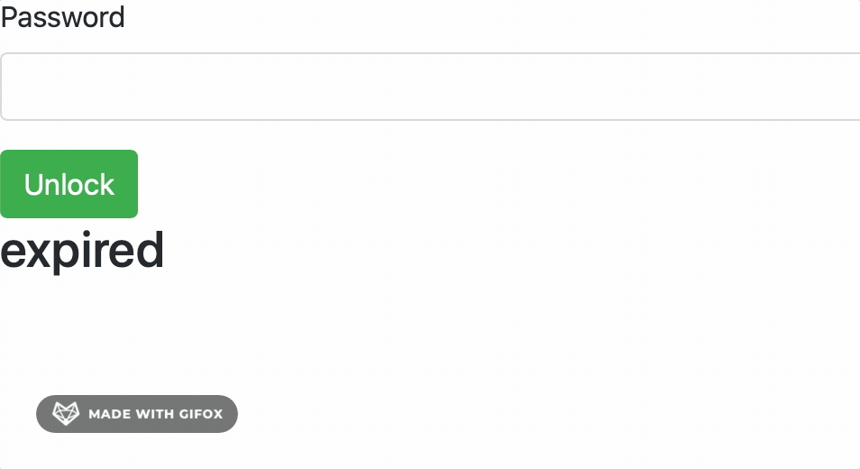

# Password Vault

A local Flask app for encrypting and storing sensitive data (passwords, credentials) in a SQLite database using Fernet symmetric encryption.

<p align="center">
  
</p>

## Setup

Requires Python 3.11+ and [Poetry](https://python-poetry.org/docs/#installation).

```bash
git clone <repo>
cd password_vault
poetry install --only main
```

Set a strong Flask secret key before running (optional for local dev, required in production):

```bash
export FLASK_SECRET_KEY="your-secret-key-here"
```

## Adding entries

1. Create `password.txt` containing your vault password (one line)
2. Add the sensitive data you want to encrypt to `file_to_encrypt.txt` (one entry per line)
3. Run the **Encryption.ipynb** notebook — it reads both files, encrypts each line, and stores the ciphertext to the local database
4. Delete `file_to_encrypt.txt` and `password.txt` immediately after

Repeat steps 1–4 whenever you need to add new entries.

## Running the app

```bash
poetry run python app.py
```

Then open [http://localhost:4995](http://localhost:4995), enter your password, and your entries will be displayed for 5 seconds before expiring.

> **Note:** Close the browser tab after use. The password can be resubmitted via page refresh while the tab is open.

## Development

```bash
poetry install          # installs all deps including dev (pytest)
poetry run pytest tests/ -v
```

## Security notes

- Encryption uses [Fernet](https://cryptography.io/en/latest/fernet/) (AES-128-CBC + HMAC-SHA256) with a key derived via PBKDF2-HMAC-SHA256 (100,000 iterations)
- All data stays local — no network calls
- Set `FLASK_SECRET_KEY` from a secrets manager or environment variable in any non-local deployment
- The app is intended for personal, local use only
